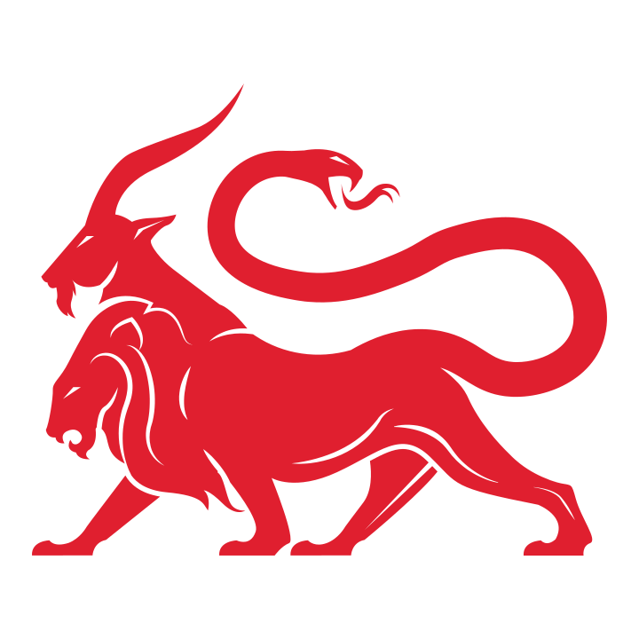

<h3> Mythic Meta Organization</h3>

The `MythicMeta` organization contains repositories related to the various "meta" components of Mythic. This includes things like the code for Docker images and the code for the mythic-container PyPi and Golang packages.

* [Community Overview](https://mythicmeta.github.io/overview/)
* [Agent Capabilities Matrix](https://mythicmeta.github.io/overview/agent_matrix.html)
* [PyPi/Golang packages/source code](https://github.com/MythicMeta)
* [Mythic](https://github.com/its-a-feature/Mythic)